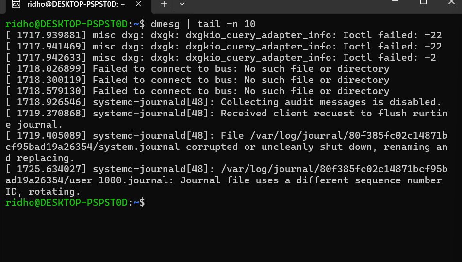
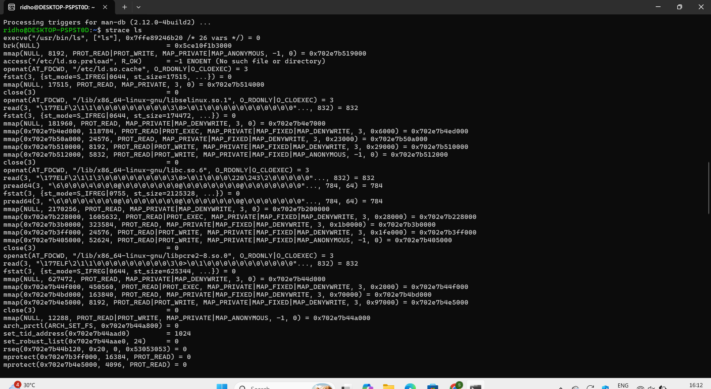

# Laporan Praktikum Minggu [X]
Topik: Struktur System Call dan Fungsi Kernel

---

## Identitas
- **Nama**  : RIDHO YOGA YUWANA  
- **NIM**   : 250202963
- **Kelas** : 1IKRA

---

## Tujuan
Tuliskan tujuan praktikum minggu ini.  

Menjelaskan konsep dan fungsi system call dalam sistem operasi.
Mengidentifikasi jenis-jenis system call dan fungsinya.
Mengamati alur perpindahan mode user ke kernel saat system call terjadi.
Menggunakan perintah Linux untuk menampilkan dan menganalisis system cal

---

## Dasar Teori
Setup Environment

Gunakan Linux (Ubuntu/WSL).
Pastikan perintah strace dan man sudah terinstal.
Konfigurasikan Git (jika belum dilakukan di minggu sebelumnya).
Eksperimen 1 – Analisis System Call Jalankan perintah berikut:

strace ls
Catat 5–10 system call pertama yang muncul dan jelaskan fungsinya.
Simpan hasil analisis ke results/syscall_ls.txt.

Eksperimen 2 – Menelusuri System Call File I/O Jalankan:

strace -e trace=open,read,write,close cat /etc/passwd
Analisis bagaimana file dibuka, dibaca, dan ditutup oleh kernel.

Eksperimen 3 – Mode User vs Kernel Jalankan:

dmesg | tail -n 10
Amati log kernel yang muncul. Apa bedanya output ini dengan output dari program biasa?

Diagram Alur System Call

Buat diagram yang menggambarkan alur eksekusi system call dari program user hingga kernel dan kembali lagi ke user mode.
Gunakan draw.io / mermaid.
Simpan di:
praktikum/week2-syscall-structure/screenshots/syscall-diagram.png
Commit & Push

git add .
git commit -m "Minggu 2 - Struktur System Call dan Kernel Interaction"
git push origin main


## Langkah Praktikum 
1. **Setup Environment**
   - Gunakan Linux (Ubuntu/WSL).
   - Pastikan perintah `strace` dan `man` sudah terinstal.
   - Konfigurasikan Git (jika belum dilakukan di minggu sebelumnya).

2. **Eksperimen 1 – Analisis System Call**
   Jalankan perintah berikut:
   ```bash
   strace ls
   ```
   > Catat 5–10 system call pertama yang muncul dan jelaskan fungsinya.  
   Simpan hasil analisis ke `results/syscall_ls.txt`.

3. **Eksperimen 2 – Menelusuri System Call File I/O**
   Jalankan:
   ```bash
   strace -e trace=open,read,write,close cat /etc/passwd
   ```
   > Analisis bagaimana file dibuka, dibaca, dan ditutup oleh kernel.

4. **Eksperimen 3 – Mode User vs Kernel**
   Jalankan:
   ```bash
   dmesg | tail -n 10
   ```
   > Amati log kernel yang muncul. Apa bedanya output ini dengan output dari program biasa?

5. **Diagram Alur System Call**
   - Buat diagram yang menggambarkan alur eksekusi system call dari program user hingga kernel dan kembali lagi ke user mode.
   - Gunakan draw.io / mermaid.
   - Simpan di:
     ```
     praktikum/week2-syscall-structure/screenshots/syscall-diagram.png
     ```

6. **Commit & Push**
   ```bash
   git add .
   git commit -m "Minggu 2 - Struktur System Call dan Kernel Interaction"
   git push origin main
   ```


---

## Kode / Perintah
Tuliskan potongan kode atau perintah utama:
```bash
strace ls
dmesg | tail -n 10
strace -e trace=open,read,write,close cat/etc/passwd

```

---

## Hasil Eksekusi
Sertakan screenshot hasil percobaan atau diagram:



---

## Analisis
## Analisis
Pentingnya System Call untuk Keamanan Sistem Operasi
System call merupakan jembatan utama antara user space dan kernel space dalam sistem operasi. Tanpa adanya system call, program pengguna tidak akan bisa berinteraksi dengan sumber daya sistem seperti file, memori, atau perangkat keras. Namun, karena kernel memiliki hak istimewa tertinggi dalam sistem, maka setiap interaksi dari program pengguna ke kernel harus dilakukan secara hati-hati dan terkontrol. Inilah sebabnya system call berperan sangat penting dalam menjaga keamanan sistem operasi.

Pertama, system call memastikan bahwa proses pengguna tidak dapat mengakses langsung sumber daya kritis milik kernel. Semua permintaan dari aplikasi harus melalui API system call, di mana kernel akan memverifikasi izin dan konteks eksekusi sebelum mengeksekusi perintah. Misalnya, ketika sebuah proses mencoba membuka file menggunakan open(), kernel akan memeriksa hak akses pengguna terhadap file tersebut. Jika tidak memiliki izin, kernel akan menolak permintaan dengan mengembalikan kode kesalahan seperti EACCES. Dengan mekanisme ini, system call berfungsi sebagai lapisan keamanan yang mencegah penyalahgunaan sumber daya sistem, baik secara sengaja maupun tidak sengaja.

Kedua, keamanan juga dijaga melalui mekanisme transisi antara user mode dan kernel mode. Dalam arsitektur sistem operasi modern seperti Linux, terdapat dua mode utama eksekusi: user mode dan kernel mode. Saat sebuah program memanggil system call, prosesor akan beralih dari user mode ke kernel mode menggunakan instruksi khusus (seperti syscall atau int 0x80). Transisi ini penting karena di kernel mode, sistem memiliki akses penuh ke seluruh memori dan perangkat keras. Setelah perintah kernel selesai dijalankan, kontrol dikembalikan ke program di user mode.

Untuk memastikan proses transisi ini aman, sistem operasi menerapkan proteksi memori dan validasi parameter. Kernel memeriksa apakah data atau alamat memori yang diterima dari aplikasi berada di ruang memori pengguna dan bukan di area kernel. Jika ditemukan pelanggaran, sistem akan menghentikan proses tersebut untuk mencegah kebocoran atau kerusakan data. Selain itu, sistem juga menggunakan tabel khusus seperti System Call Table yang berisi daftar fungsi yang boleh diakses oleh user space. Dengan cara ini, hanya system call yang sah yang dapat dipanggil, sehingga mencegah eksekusi kode berbahaya di dalam kernel.

Contoh system call yang sering digunakan dalam sistem operasi Linux antara lain:
•	open() dan close() untuk membuka dan menutup file.
•	read() dan write() untuk membaca serta menulis data ke file atau perangkat.
•	fork() untuk membuat proses baru.
•	execve() untuk mengeksekusi program baru.
•	wait() untuk menunggu proses anak selesai.
•	exit() untuk mengakhiri proses dengan aman.
•	getpid() dan kill() untuk mengatur proses melalui ID-nya.


---
## Hasil Observasi
**Tabel Observasi Hasil Eksperimen strace**
| No | System Call | Deskripsi Fungsi                                                                               | Keterangan / Hasil Observasi                                                 |
| -- | ----------- | ---------------------------------------------------------------------------------------------- | ---------------------------------------------------------------------------- |
| 1  | `execve()`  | Menjalankan program baru (dalam hal ini `/usr/bin/ls`) dengan argumen dan variabel lingkungan. | Proses dimulai, sistem menjalankan perintah `ls`.                            |
| 2  | `brk()`     | Mengatur batas ruang memori proses untuk alokasi dinamis (heap).                               | Kernel menyesuaikan memori yang dibutuhkan program.                          |
| 3  | `mmap()`    | Memetakan file atau perangkat ke memori virtual proses.                                        | Digunakan untuk mengalokasikan ruang memori tambahan.                        |
| 4  | `access()`  | Mengecek izin akses terhadap file tertentu.                                                    | Mengecek file konfigurasi `/etc/ld.so.preload`, hasilnya tidak ada (ENOENT). |
| 5  | `openat()`  | Membuka file pada direktori tertentu.                                                          | Membuka file cache library `/etc/ld.so.cache` untuk mencari dependensi.      |
| 6  | `fstat()`   | Mengambil informasi status file yang dibuka.                                                   | Mengecek ukuran dan tipe file cache library.                                 |
| 7  | `mmap()`    | Memetakan isi file yang dibuka ke memori.                                                      | Agar lebih efisien dalam membaca data library.                               |
| 8  | `close()`   | Menutup file descriptor setelah digunakan.                                                     | File cache ditutup setelah selesai dibaca.                                   |
| 9  | `read()`    | Membaca data dari file descriptor.                                                             | Membaca header ELF library yang dibuka.                                      |
| 10 | `openat()`  | Membuka library lain seperti `libselinux.so.1`.                                                | Program mulai memuat dependensi yang dibutuhkan untuk eksekusi.              |


**Tabel Observasi Hasil Eksperimen dmesg**
| No | Waktu (s) | Pesan Kernel                                                              | Deskripsi / Interpretasi                                                  |
| -- | --------- | ------------------------------------------------------------------------- | ------------------------------------------------------------------------- |
| 1  | 2.80      | `systemd-journald[42]: Collecting audit messages is disabled.`            | Kernel mencatat bahwa proses logging audit tidak diaktifkan.              |
| 2  | 2.91      | `systemd-journald[42]: Received client request to flush runtime journal.` | Sistem logging menerima permintaan untuk membersihkan log sementara.      |
| 3  | 2.91      | `File /var/log/journal/... corrupted or uncleanly shut down`              | Kernel mendeteksi log sebelumnya rusak dan menggantinya dengan yang baru. |
| 4  | 3.13      | `ACPI: battery: Slot [BAT1] (battery present)`                            | Kernel mendeteksi keberadaan baterai pada perangkat.                      |
| 5  | 3.14      | `ACPI: AC Adapter [AC1] (off-line)`                                       | Adaptor daya sedang tidak tersambung.                                     |
| 6  | 3.48      | `kvm_intel: Using Hyper-V Enlightened VMCS`                               | Kernel mendeteksi sistem berjalan di lingkungan virtual (WSL/Hyper-V).    |
| 7  | 6.00      | `systemd-journald: user-1000.journal rotating`                            | Kernel melakukan rotasi file log pengguna.                                |
| 8  | 6.01      | `TCP: eth0: Driver has suspect GRO implementation`                        | Kernel memberi peringatan terkait performa jaringan.                      |
| 9  | 6.34      | `WSL (214) ERROR: CheckConnection: getaddrinfo() failed`                  | Kernel WSL gagal melakukan resolve jaringan.                              |
| 10 | 48.47     | `hv_balloon: Max. dynamic memory size: 4024 MB`                           | Kernel melaporkan batas maksimum memori dinamis yang dialokasikan di WSL. |


## Kesimpulan
System call berperan penting sebagai penghubung antara program pengguna dan kernel dalam sistem operasi. Melalui system call, program dapat meminta layanan seperti membuka file, membaca data, membuat proses baru, dan mengakses perangkat dengan aman tanpa langsung berinteraksi dengan kernel. Praktikum menggunakan perintah strace membantu memahami bagaimana kernel menangani setiap panggilan system call yang terjadi saat program dijalankan, sedangkan dmesg menunjukkan aktivitas dan pesan yang dicatat langsung oleh kernel. Selain itu, percobaan ini juga menunjukkan pentingnya mekanisme user mode dan kernel mode dalam menjaga keamanan serta kestabilan sistem. Dengan demikian, system call menjadi komponen krusial dalam pengelolaan sumber daya dan pengendalian akses pada sistem operasi Linux.

---


## Quiz
1. Apa fungsi utama system call dalam sistem operasi?  
   **Jawaban:**
   **Fungsi utama system call adalah sebagai penghubung antara program pengguna (user space) dengan kernel (system space) agar aplikasi dapat meminta layanan dari sistem operasi seperti membaca atau menulis file, mengalokasikan memori, membuat proses baru, atau berkomunikasi dengan perangkat keras. System call memungkinkan interaksi ini dilakukan dengan aman dan terkontrol tanpa memberi akses langsung kepada user terhadap sumber daya kernel.**
     
2. Sebutkan 4 kategori system call yang umum digunakan.  
   **Jawaban:**
   **Empat kategori utama system call yang umum digunakan dalam sistem operasi adalah:**
**1.	Process Control – untuk membuat, menghentikan, dan mengatur proses (contoh: fork(), execve(), exit(), wait()).**
**2.	File Management – untuk operasi file seperti membuka, membaca, menulis, atau menutup file (contoh: open(), read(), write(), close()).**
**3.	Device Management – untuk mengontrol dan mengakses perangkat input/output (contoh: ioctl(), read(), write()).**
**4.	Information Maintenance – untuk mendapatkan atau mengatur informasi sistem (contoh: getpid(), uname(), gettimeofday()).**

3. Mengapa system call tidak bisa dipanggil langsung oleh user program? 
   **Jawaban:**
   **System call tidak dapat dipanggil langsung oleh program pengguna karena berjalan di tingkat kernel (privileged mode), sedangkan program biasa berjalan di user mode. Hal ini bertujuan untuk menjaga keamanan dan stabilitas sistem operasi, agar pengguna tidak bisa mengakses atau mengubah sumber daya kernel secara langsung yang dapat menyebabkan kerusakan sistem, kebocoran data, atau crash. Oleh karena itu, program hanya dapat memanggil system call melalui antarmuka API yang disediakan oleh sistem operasi (misalnya pustaka C glibc di Linux).**


---

## Refleksi Diri
Tuliskan secara singkat:
- Apa bagian yang paling menantang minggu ini?
  Hal yang menantang pada minggu kedua adalah saya mulai bingung dan pusing dan mengerjakan hingga begadang, tulisan yang keluar pada program cukup banyak dan saya butuh waktu lama untuk memahami baris pada strace. Proses transisi antara kedua mode cukup membingungkan karena melibatkan banyak tahapan yang tidak terlihat langsung. Selain itu, menafsirkan hasil keluaran strace dan dmesg juga memerlukan ketelitian, sebab output-nya berisi banyak baris teknis yang harus dianalisis untuk mengetahui fungsi masing-masing system call. 
- Bagaimana cara Anda mengatasinya?
  Saya mengatasinya dengan mempelajari kembali teori dasar tentang system call dan mode eksekusi sistem operasi melalui modul praktikum, referensi dari
  1. Abraham Silberschatz, Peter Baer Galvin, Greg Gagne. *Operating System Concepts*, 10th Edition, Wiley, 2018.  
2. Andrew S. Tanenbaum, Herbert Bos. *Modern Operating Systems*, 4th Edition, Pearson, 2015.  
3. Linux Manual Pages (`man 2 syscalls`, `man strace`).  
4. OSTEP – *Operating Systems: Three Easy Pieces*, 2018.  
5. https://man7.org/linux/man-pages/man2/syscalls.2.html
   dan referensi tambahan di internet, Walaupun sedikit pening praktikum berjalan lancar. Dan dengan membaca dokumentasi dan melakukan pengamatan berulang, pemahaman mengenai bagaimana kernel menangani permintaan dari program pengguna menjadi lebih jelas.
---

**Credit:**  
_Template laporan praktikum Sistem Operasi (SO-202501) – Universitas Putra Bangsa_
