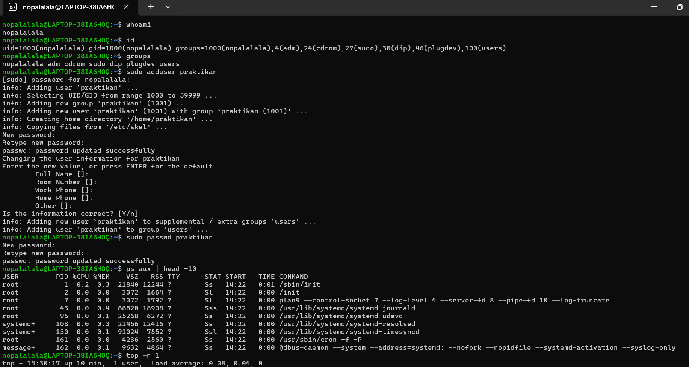

# Laporan Praktikum Minggu [4]
Topik: Manajemen Proses dan User di Linux


## Identitas
- **Nama**  : Naufal Adib Bissibyan 
- **NIM**   : 250202958  
- **Kelas** : 1 IKRA

---

## Tujuan
Setelah menyelesaikan tugas ini, mahasiswa mampu:

1. Menjelaskan konsep proses dan user dalam sistem operasi Linux.
2. Menampilkan daftar proses yang sedang berjalan dan statusnya.
3. Menggunakan perintah untuk membuat dan mengelola user.
4. Menghentikan atau mengontrol proses tertentu menggunakan PID.
5. Menjelaskan kaitan antara manajemen user dan keamanan sistem

---

## Dasar Teori
1. **Proses di Linux** adalah program yang sedang berjalan. Setiap proses punya nomor unik (PID) dan bisa membuat proses lain (anak proses). Semua proses ini diatur dalam bentuk pohon, dengan `init` atau `systemd` sebagai induknya.
2. **Pengelolaan proses** dilakukan dengan perintah seperti `ps` (melihat proses), `top` atau `htop` (memantau aktivitas sistem), dan `kill` (menghentikan proses). Linux juga memungkinkan pengaturan prioritas proses agar sistem tetap lancar.
3. **User dan group** digunakan untuk mengatur siapa yang bisa mengakses sistem. Setiap pengguna punya ID sendiri (UID), dan mereka bisa masuk ke dalam satu atau beberapa group (GID). Data tentang user tersimpan di file seperti `/etc/passwd`.
4. **Hak akses dan keamanan** diatur supaya pengguna hanya bisa melakukan hal yang diizinkan. Hak ini bisa diubah dengan `chmod`, `chown`, dan `chgrp`. Admin (root) punya kendali penuh untuk membuat atau menghapus user, menjaga sistem tetap aman dan tertata.

---

## Langkah Praktikum
1. **Setup Environment**
   - Gunakan Linux (Ubuntu/WSL).  
   - Pastikan Anda sudah login sebagai user non-root.  
   - Siapkan folder kerja:
     ```
     praktikum/week4-proses-user/
     ```

2. **Eksperimen 1 – Identitas User**
   Jalankan perintah berikut:
   ```bash
   whoami
   id
   groups
   ```
   - Jelaskan setiap output dan fungsinya.  
   - Buat user baru (jika memiliki izin sudo):
     ```bash
     sudo adduser praktikan
     sudo passwd praktikan
     ```
   - Uji login ke user baru.

3. **Eksperimen 2 – Monitoring Proses**
   Jalankan:
   ```bash
   ps aux | head -10
   top -n 1
   ```
   - Jelaskan kolom penting seperti PID, USER, %CPU, %MEM, COMMAND.  
   - Simpan tangkapan layar `top` ke:
     ```
     praktikum/week4-proses-user/screenshots/top.png
     ```

4. **Eksperimen 3 – Kontrol Proses**
   - Jalankan program latar belakang:
     ```bash
     sleep 1000 &
     ps aux | grep sleep
     ```
   - Catat PID proses `sleep`.  
   - Hentikan proses:
     ```bash
     kill <PID>
     ```
   - Pastikan proses telah berhenti dengan `ps aux | grep sleep`.

5. **Eksperimen 4 – Analisis Hierarki Proses**
   Jalankan:
   ```bash
   pstree -p | head -20
   ```
   - Amati hierarki proses dan identifikasi proses induk (`init`/`systemd`).  
   - Catat hasilnya dalam laporan.

6. **Commit & Push**
   ```bash
   git add .
   git commit -m "Minggu 4 - Manajemen Proses & User"
   git push origin main
---

## Kode / Perintah
Tuliskan potongan kode atau perintah utama:
```bash
uname -a
lsmod | head
dmesg | head
```

---

## Hasil Eksekusi
Sertakan screenshot hasil percobaan atau diagram:
 


---

## Analisis
Dari hasil percobaan yang telah dilakukan, dapat dipahami bahwa setiap aktivitas di sistem operasi Linux dijalankan sebagai suatu proses yang memiliki identitas unik berupa PID (Process ID). Melalui perintah seperti ps, top, dan pstree, pengguna dapat memantau status, hierarki, serta penggunaan sumber daya dari setiap proses yang berjalan. Selain itu, dengan perintah sleep dan kill, pengguna juga dapat membuat, memantau, atau menghentikan proses secara langsung. Hasil ini menunjukkan bahwa Linux memiliki sistem multitasking yang efisien dan terstruktur, di mana setiap proses dapat dijalankan secara paralel tanpa saling mengganggu. Dengan adanya informasi seperti USER, %CPU, dan %MEM, pengguna dapat memahami bagaimana sistem mengalokasikan sumber daya untuk setiap proses.

Hasil percobaan ini berkaitan erat dengan teori dasar tentang fungsi kernel dan system call dalam arsitektur sistem operasi. Kernel berperan sebagai inti sistem yang bertugas untuk mengelola proses, memori, dan komunikasi antar-proses. Ketika pengguna menjalankan perintah melalui shell, kernel akan memanggil system call seperti fork() dan exec() untuk membuat dan mengeksekusi proses baru. Hal ini menunjukkan bahwa ada interaksi langsung antara user space (tempat perintah dijalankan) dengan kernel space (tempat kernel bekerja). Arsitektur Linux yang berlapis (layered architecture) memisahkan kedua ruang tersebut agar sistem tetap stabil dan aman. Dengan demikian, percobaan ini membuktikan bagaimana perintah sederhana di terminal sebenarnya merupakan bagian dari mekanisme yang lebih dalam antara shell, kernel, dan manajemen proses di sistem operasi.

Perbedaan hasil di lingkungan OS berbeda (Linux vs Windows) :

| Aspek                     | Linux                                                                 | Windows                                                                               |
| ------------------------- | --------------------------------------------------------------------- | ------------------------------------------------------------------------------------- |
| **Manajemen Proses**      | Menggunakan perintah terminal (`ps`, `top`, `kill`, `pstree`).        | Menggunakan GUI (Task Manager) dan CLI (`tasklist`, `taskkill`).                      |
| **Struktur Hierarki**     | Memiliki *parent-child process tree*, berawal dari `systemd (PID 1)`. | Menggunakan *Process Manager*, tetapi hierarki tidak selalu ditampilkan secara jelas. |
| **System Call**           | Terbuka dan dapat diakses melalui shell, fleksibel untuk scripting.   | Lebih tertutup dan dikontrol oleh kernel secara internal.                             |
| **Interaksi User–Kernel** | Terjadi langsung melalui shell berbasis teks.                         | Lebih sering melalui antarmuka grafis (GUI).                                          |
## Kesimpulan
manajemen proses dan user di Linux merupakan bagian penting untuk menjaga stabilitas, keamanan, dan efisiensi sistem. Proses di Linux memiliki struktur hierarki, di mana setiap proses memiliki PID dan dapat memiliki proses anak, dan semuanya dikendalikan oleh proses induk utama seperti init atau system. User dan group digunakan untuk mengatur hak akses, sehingga hanya pengguna tertentu yang dapat melakukan operasi sensitif, sementara root memiliki hak istimewa untuk mengelola seluruh sistem. Melalui percobaan ini, pemahaman tentang perintah seperti ps, top, kill, killall, chmod, dan chown menjadi lebih jelas, sehingga teori tentang proses dan manajemen user dapat diterapkan secara praktis di sistem Linux.

## Quiz
1. Apa fungsi dari proses init atau systemd dalam sistem Linux?
   **Jawaban:**

   Proses **`init` atau `systemd`** adalah proses pertama yang dijalankan saat Linux dinyalakan dan berfungsi sebagai **induk dari semua proses lain** di sistem. Ia bertugas memulai berbagai layanan penting seperti jaringan, login, dan pengelolaan sistem, serta memastikan semua proses berjalan dan dihentikan dengan benar. Jika ada proses yang kehilangan induknya, `systemd` akan “mengadopsinya” agar sistem tetap stabil. Selain itu, `systemd` juga mengatur proses saat komputer dimatikan atau direstart, sehingga sistem bisa beroperasi dan berhenti dengan aman serta teratur.

2. Apa perbedaan antara kill dan killall? 
   **Jawaban:**
   
Perintah **`kill`** dan **`killall`** di Linux sama-sama digunakan untuk menghentikan proses, tetapi cara kerjanya berbeda. **`kill`** bekerja dengan menggunakan **PID (Process ID)**, yaitu nomor unik yang diberikan sistem untuk setiap proses yang sedang berjalan. Jadi, agar bisa menggunakan `kill`, kamu harus tahu nomor PID proses yang ingin dihentikan, misalnya dengan perintah `ps` atau `top`. Contohnya, `kill 1234` akan menghentikan proses dengan PID 1234 saja. Sementara itu, **`killall`** lebih praktis karena kamu hanya perlu menyebut **nama programnya**, bukan PID-nya. Misalnya, `killall firefox` akan menghentikan semua proses yang bernama *firefox* sekaligus. Dengan kata lain, `kill` cocok untuk menghentikan satu proses tertentu, sedangkan `killall` lebih efisien untuk menutup beberapa proses yang menjalankan program yang sama.

   
3. Mengapa user root memiliki hak istimewa di sistem Linux? 
   **Jawaban:**  

Karena root berperan sebagai administrator utama atau superuser, ia memiliki hak istimewa di sistem Linux untuk mengendalikan seluruh aspek sistem. Hak ini memungkinkan root melakukan tugas penting seperti menginstal atau menghapus program, mengubah konfigurasi sistem, mengelola user lain, serta mengatur izin dan kepemilikan file. Hak istimewa ini diperlukan agar sistem tetap aman, stabil, dan terkelola dengan baik, karena jika semua user biasa bisa melakukan operasi sensitif, risiko kesalahan atau penyalahgunaan akan sangat tinggi. Dengan demikian, root memiliki kontrol penuh untuk menjaga keamanan dan kelancaran sistem Linux secara menyeluruh.


## Refleksi Diri
Tuliskan secara singkat:
- Apa bagian yang paling menantang minggu ini?  bagian yang paling menantang minggu ini adalah memahami prosedur linux
- Bagaimana cara Anda mengatasinya?   Untuk mengatasinya, saya melakukan praktik langsung di terminal, seperti memantau proses dengan ps dan top, mencoba perintah kill, killall, nice, serta membuat user baru dan mengatur hak akses file dengan chmod dan chown. Praktik langsung membuat teori lebih mudah dipahami dan diingat.
---


---

**Credit:**  
_Template laporan praktikum Sistem Operasi (SO-202501) – Universitas Putra Bangsa_
